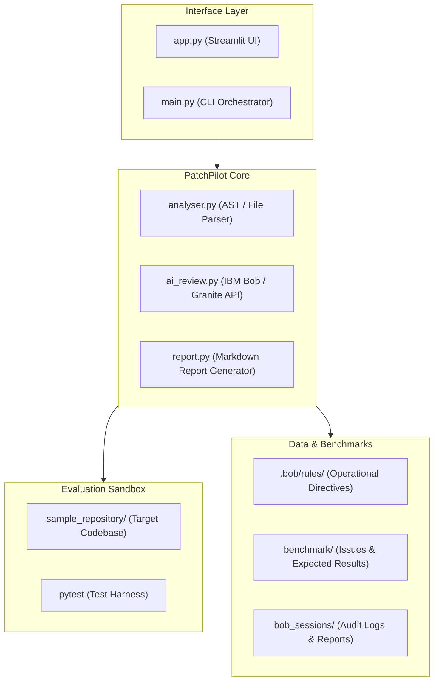

# PatchPilot-Python Architecture Overview

## 1. System Overview
**PatchPilot-Python** is an autonomous code diagnosis and repair system orchestrated by **IBM Bob**. It continuously ingests issue manifests, performs static and AST codebase analysis, interacts with IBM Bob foundation models, runs localized verification tests in a sandbox environment, and renders reports via Streamlit and Markdown.

---

## 2. Component Diagram

---

## 3. Module Responsibilities
- **`app.py`**: Web-based interaction portal for developers to observe agent steps, diffs, and test outcomes.
- **`main.py`**: Scriptable CLI pipeline for automated CI/CD and benchmark execution.
- **`analyser.py`**: Discovers repository files, constructs abstract syntax trees, and isolates candidate symbols.
- **`ai_review.py`**: Bridges prompts with IBM Bob models for reasoning and patch generation.
- **`report.py`**: Compiles reproducible execution artifacts into Markdown documents.
